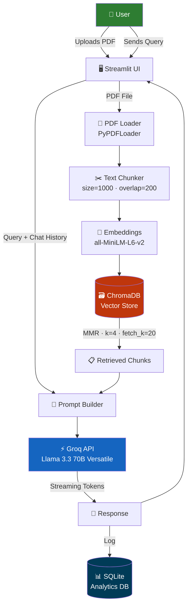
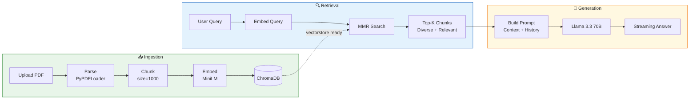
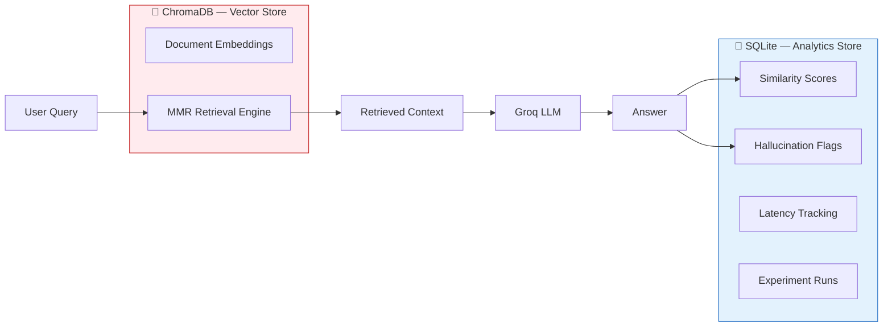
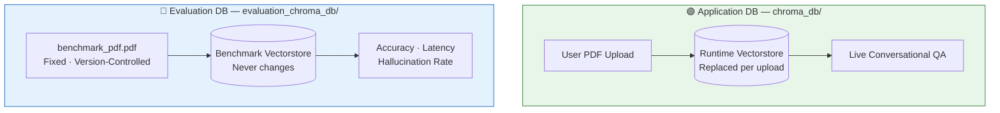
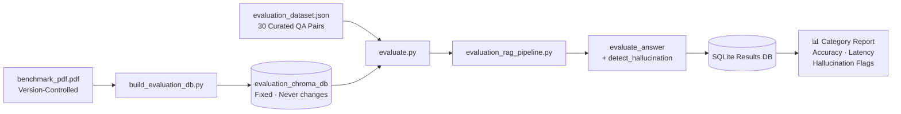

<div align="center">


<br/>

[](https://python.org)
[](https://langchain.com)
[](https://trychroma.com)
[](https://groq.com)
[](https://streamlit.io)
[](https://sqlite.org)

<br/>

[-1d9e75?style=flat-square)](.)
[-2E7D32?style=flat-square)](.)
[-1565C0?style=flat-square)](.)
[-BA7517?style=flat-square)](.)
[](.)
[](LICENSE)

<br/>

> **BOLVEDA** is a production-grade Retrieval-Augmented Generation (RAG) system for contextual PDF querying.
> Upload a document. Ask anything. Get grounded, hallucination-reduced answers — powered by semantic retrieval, conversational memory, and Llama 3.3 70B.

<br/>

[**Architecture**](#-system-architecture) &nbsp;·&nbsp; [**Evaluation**](#-evaluation-framework) &nbsp;·&nbsp; [**Results**](#-benchmark-results) &nbsp;·&nbsp; [**Setup**](#-getting-started) &nbsp;·&nbsp; [**Interview Guide**](#-interview-discussion-points)

</div>

---

<details>
<summary><b>📋 Table of Contents</b></summary>

- [The Problem](#-the-problem)
- [Features](#-features)
- [System Architecture](#-system-architecture)
- [RAG Pipeline](#-rag-pipeline)
- [Tech Stack](#-tech-stack)
- [Dual Database Architecture](#-dual-database-architecture)
- [Dual Vector Database Architecture](#-dual-vector-database-architecture)
- [Evaluation Framework](#-evaluation-framework)
- [Benchmark Results](#-benchmark-results)
- [Project Structure](#-project-structure)
- [Key Engineering Decisions](#-key-engineering-decisions)
- [Robustness Engineering](#-robustness-engineering)
- [Performance Metrics](#-performance-metrics)
- [Getting Started](#-getting-started)
- [Future Improvements](#-future-improvements)
- [What I Learned](#-what-i-learned)
- [Why BOLVEDA Stands Out](#-why-bolveda-stands-out)
- [Interview Discussion Points](#-interview-discussion-points)
- [License](#-license)

</details>

---

## ⚡ The Problem

Standard LLMs have fundamental limitations when working with documents:

| Problem | Reality | BOLVEDA's Fix |
|---|---|---|
| **Hallucination** | LLMs fabricate answers when document-specific facts aren't in their weights | Every response grounded in retrieved document chunks |
| **No document awareness** | LLMs can't read your private PDFs at inference time | Local vector pipeline — no document baked into model weights |
| **Unmeasurable quality** | "It feels right" is not an engineering metric | Automated evaluation framework with quantitative benchmark scores |

---

## ✨ Features

<table>
<tr>
<td width="50%">

### 🤖 Core AI
- **PDF ingestion** with fault-tolerant parsing
- **Recursive chunking** — size 1000, overlap 200
- **MiniLM embeddings** for semantic representation
- **MMR retrieval** — diverse, relevant context selection
- **Llama 3.3 70B** via Groq for fast generation
- **Token streaming** for real-time UX
- **Citation generation** per answer
- **Conversational memory** across the session

</td>
<td width="50%">

### ⚙️ Engineering
- **Dual-database architecture** — ChromaDB + SQLite
- **Isolated benchmark DB** — evaluation never touches user data
- **Automated benchmarking** — one command, full report
- **Category-wise accuracy** — factual / inferential / out-of-scope
- **Hallucination detection** — similarity-based context grounding check
- **Privacy-safe lifecycle** — temp files, session memory only
- **Vectorstore lifecycle management** — replaced per upload
- **Graceful failure handling** — empty retrieval, malformed PDFs

</td>
</tr>
</table>

---

## 🏗️ System Architecture



---

## 🔄 RAG Pipeline



---

## 🛠️ Tech Stack

<div align="center">

| Layer | Technology | Purpose |
|---|---|---|
| 🖥️ **Frontend** | Streamlit | UI, streaming display, session state |
| 🐍 **Backend** | Python 3.10+ | Core application logic |
| 🤖 **LLM** | Groq + Llama 3.3 70B Versatile | Ultra-fast inference, streaming generation |
| 🔢 **Embeddings** | `sentence-transformers/all-MiniLM-L6-v2` | Local 384-dim vectors, zero API cost |
| 🗃️ **Vector DB** | ChromaDB | Embedding storage + MMR retrieval |
| 📊 **Analytics DB** | SQLite | Evaluation results, experiment tracking |
| 🔗 **Orchestration** | LangChain | RAG chain construction, prompt management |
| 📚 **Libraries** | HuggingFace · PyPDF · Chroma | Embeddings, PDF parsing, retrieval |

</div>

---

## 🗄️ Dual Database Architecture

BOLVEDA uses two databases for two fundamentally different jobs — vector search and structured analytics are not the same problem.



| | ChromaDB | SQLite |
|---|---|---|
| **Type** | Vector Database | Relational Database |
| **Stores** | Dense embeddings + chunk text | Scores, latencies, hallucination flags |
| **Optimized For** | Nearest-neighbor search in high-dimensional space | SQL aggregations, GROUP BY category |
| **Lifecycle** | Replaced per PDF upload | Persistent across all sessions |

> **Why two databases?** ChromaDB handles nearest-neighbor search in embedding space. SQLite handles structured aggregations and experiment tracking. Using the right tool for each job is a core design principle of BOLVEDA.

---

## 🔀 Dual Vector Database Architecture

Two completely separate ChromaDB instances — one for the live app, one locked for evaluation. This separation is non-negotiable for benchmark integrity.



| | `chroma_db/` | `evaluation/evaluation_chroma_db/` |
|---|---|---|
| **Source** | User-uploaded PDFs | Fixed `benchmark_pdf.pdf` |
| **Behavior** | Replaced on each upload | Never changes |
| **Purpose** | Live conversational QA | Reproducible evaluation |

> If evaluation shared the runtime vectorstore, every user PDF upload would silently corrupt the benchmark — results would be incomparable across runs. Isolation is a hard requirement, not a nice-to-have.

---

## 🧪 Evaluation Framework

The most significant engineering investment in BOLVEDA. AI systems should be measurable — not just "it feels right".

### Why We Built It

Without evaluation, the only signal was "the answer looks right" — manual inspection that doesn't scale and can't track regressions. BOLVEDA needed objective answers to:

- Is retrieval working correctly?
- Is the model hallucinating on out-of-scope questions?
- Did this code change improve or hurt performance?

### Benchmark Dataset

**30 questions** across three categories, all grounded in `benchmark_pdf.pdf`:

| Category | Count | Tests |
|---|---|---|
| **Factual** | 10 | Direct lookup — answer exists verbatim in document |
| **Inferential** | 10 | Multi-hop reasoning across chunks |
| **Out-of-Scope** | 10 | Intentionally unanswerable from document |

```json
{
  "questions": [
    {
      "id": "F001",
      "category": "factual",
      "question": "What is tokenization?",
      "expected_answer": "Tokenization converts text into tokens.",
      "question_type": "factual"
    },
    {
      "id": "I001",
      "category": "inferential",
      "question": "Why does RAG reduce hallucinations compared to standard LLMs?",
      "expected_answer": "..."
    },
    {
      "id": "O001",
      "category": "out_of_scope",
      "question": "Who won FIFA 2018?",
      "expected_answer": "This information is not present in the document."
    }
  ]
}
```

### Scoring Pipeline

```python
# Answer quality — keyword overlap between generated and expected answers
def evaluate_answer(expected: str, generated: str) -> float:
    expected_words = set(preprocess(expected))   # lowercase, remove stopwords
    generated_words = set(preprocess(generated))
    matched = expected_words & generated_words
    return len(matched) / len(expected_words)    # threshold: 0.4 = correct

# Hallucination detection — answer vs retrieved context overlap
def detect_hallucination(answer: str, retrieved_context: str) -> bool:
    answer_vec  = embedder.embed_query(answer)
    context_vec = embedder.embed_query(retrieved_context)
    similarity  = cosine_similarity([answer_vec], [context_vec])[0][0]
    return similarity < HALLUCINATION_THRESHOLD  # e.g. 0.65
```

### SQLite Experiment Schema

```sql
CREATE TABLE evaluation_results (
    run_id                TEXT,
    question_id           TEXT,
    category              TEXT,
    question              TEXT,
    expected_answer       TEXT,
    generated_answer      TEXT,
    similarity_score      REAL,
    is_correct            INTEGER,
    hallucination_flag    INTEGER,
    generation_latency_ms REAL,
    timestamp             DATETIME DEFAULT CURRENT_TIMESTAMP
);

CREATE TABLE run_summary (
    run_id               TEXT PRIMARY KEY,
    total_questions      INTEGER,
    correct_answers      INTEGER,
    overall_accuracy     REAL,
    factual_accuracy     REAL,
    inferential_accuracy REAL,
    oos_accuracy         REAL,
    hallucination_rate   REAL,
    avg_latency_ms       REAL
);
```

### Reproducible Benchmarking Flow



---

## 📊 Benchmark Results

**30 questions · 3 categories · automated scoring**

<div align="center">

| Category | Score | Accuracy | Analysis |
|---|---|---|---|
| ✅ **Factual** | **10 / 10** | **100%** | Retrieval precision is working perfectly |
| 🧠 **Inferential** | **7 / 10** | **70%** | 3 missed — wording mismatch, not wrong reasoning |
| 🚫 **Out-of-Scope** | **10 / 10** | **100%** | Zero hallucinations on unanswerable questions |
| 🎯 **Overall** | **27 / 30** | **90%** | Strong production-level RAG performance |

</div>

### What Each Result Proves

**Factual 100%** directly validates the entire ingestion-to-retrieval stack — chunking, embedding, ChromaDB, and MMR are all working correctly. If retrieval was broken, factual accuracy would collapse first.

**Out-of-Scope 100%** is the most important result for production. Questions like *"Who won FIFA 2018?"* and *"What is the capital of Japan?"* were correctly answered with *"I could not find that information in the provided document."* Zero hallucinations on out-of-scope inputs.

**Inferential 70% (3 missed)** exposed a limitation of the **evaluator, not the model**. The 3 incorrect answers were conceptually correct but used different wording than the expected answer. Keyword overlap scoring penalizes semantic equivalence:

```
Expected:   "Embeddings help retrieve conceptually similar information."
Generated:  "Embeddings represent semantic meaning in vector space."
→ Low keyword overlap, but same idea. Evaluator marks incorrect.
```

The fix is LLM-as-a-Judge or embedding similarity scoring — identified as the top future improvement.

---

## 📁 Project Structure

```
BOLVEDA/
├── app.py                          # Streamlit entry point
│
├── src/
│   ├── ingestion/                  # PDF loading, chunking, vectorstore creation
│   ├── rag/                        # RAG chain, MMR retrieval, prompt construction
│   ├── memory/                     # Session memory management + truncation
│   └── utils/                      # Validators, config, shared helpers
│
├── evaluation/
│   ├── benchmark_pdf.pdf           # Fixed reference PDF — never changes
│   ├── evaluation_dataset.json     # 30 curated QA pairs (factual/inferential/OOS)
│   ├── build_evaluation_db.py      # Builds isolated evaluation_chroma_db (run once)
│   ├── evaluation_ingest.py        # Ingestion pipeline for benchmark PDF
│   ├── evaluation_retrieval.py     # Separate retrieval over evaluation vectorstore
│   ├── evaluation_rag_pipeline.py  # End-to-end RAG pipeline for evaluation
│   ├── evaluation_utils.py         # Scoring, similarity, hallucination detection
│   └── evaluate.py                 # Single entry point — runs full benchmark
│
├── db/
│   ├── sqlite_setup.py             # Schema creation + DB init
│   └── db_logger.py                # Writes evaluation results to SQLite
│
├── chroma_db/                      # Runtime vectorstore (auto-replaced per upload)
└── evaluation/
    └── evaluation_chroma_db/       # Isolated benchmark vectorstore (fixed)
```

> Every folder has a single, clear responsibility. Ingestion, retrieval, memory, evaluation, and analytics are fully decoupled modules.

---

## 🎯 Key Engineering Decisions

<details>
<summary><b>Why RAG instead of Fine-Tuning?</b></summary>
<br/>
Fine-tuning bakes knowledge into model weights at training time — expensive, can't handle new documents without retraining, and exposes private documents to a training pipeline. RAG retrieves from a live index at inference time. Same model, any document, zero retraining. New document = new index in seconds.
</details>

<details>
<summary><b>Why MMR over standard similarity retrieval?</b></summary>
<br/>
Top-K retrieval returns the K most similar chunks — which are often near-duplicates when a document repeats information across pages. This wastes the entire context window on redundant text. MMR penalizes chunks that are too similar to already-selected ones:

```
MMR(chunk) = λ · sim(chunk, query) − (1−λ) · max_sim(chunk, selected)
```

Result: relevant *and* diverse context. Switched to MMR after observing degraded answer quality on multi-page documents — measurable improvement confirmed in benchmark scores.
</details>

<details>
<summary><b>Why ChromaDB over Pinecone or FAISS?</b></summary>
<br/>
ChromaDB is self-hosted, zero-infrastructure, and LangChain-native. Pinecone requires a managed cloud service (cost + latency). FAISS is a lower-level library requiring manual metadata handling. For a single-user deployment, ChromaDB runs in-process, persists to disk, and has MMR built in — right tool at this scale.
</details>

<details>
<summary><b>Why Groq over OpenAI?</b></summary>
<br/>
Groq's LPU (Language Processing Unit) hardware delivers inference significantly faster than GPU-based providers. For a streaming document assistant where perceived latency matters, this is a meaningful UX improvement. Llama 3.3 70B is a strong open-weight model competitive with GPT-4o on instruction following.
</details>

<details>
<summary><b>Why SQLite for analytics?</b></summary>
<br/>
Evaluation results are structured relational data — aggregations, GROUP BY category, cross-run comparison. That's SQL, not vector search. SQLite is serverless, ships with Python, and avoids over-engineering what is essentially an experiment tracker. Postgres would be overkill.
</details>

<details>
<summary><b>Why separate application and evaluation databases?</b></summary>
<br/>
If both shared the same vectorstore, every user PDF upload would silently change retrieval behavior during evaluation — results would be incomparable across runs. Evaluation must always run against the same document, the same embeddings, the same conditions. Isolation is what makes benchmarks reproducible.
</details>

<details>
<summary><b>How were hallucinations reduced?</b></summary>
<br/>
Three-layer approach: (1) <b>Retrieval grounding</b> — prompt contains only retrieved chunks, not the model's parametric memory. (2) <b>Prompt engineering</b> — explicit instruction to acknowledge out-of-scope questions rather than fabricating. (3) <b>Measurement</b> — OOS category directly tracks hallucination rate, confirmed at 0% in the benchmark.
</details>

<details>
<summary><b>Why session-scoped memory instead of persistent storage?</b></summary>
<br/>
Persistent chat storage creates privacy obligations — data retention, deletion rights, access control. Session-scoped memory via <code>st.session_state</code> avoids all of this. Data lives in RAM for the duration of the session and disappears when the tab closes. Correct default for a document assistant handling potentially sensitive PDFs.
</details>

---

## 🛡️ Robustness Engineering

```python
# Empty query guard
if not user_query or not user_query.strip():
    st.warning("Please enter a valid question.")
    st.stop()

# Vectorstore safety check
if st.session_state.vectorstore is None:
    st.error("Please upload a PDF document first.")
    st.stop()

# Empty retrieval fallback
if not retrieved_docs:
    return "I could not find relevant information in the document for your question."

# Malformed PDF handling
try:
    documents = loader.load()
    if not documents:
        raise ValueError("PDF appears to be empty or unreadable.")
except Exception as e:
    st.error(f"Failed to process PDF: {str(e)}")
    st.stop()

# API key validation at startup
if not os.getenv("GROQ_API_KEY"):
    st.error("GROQ_API_KEY not found. Please set it in your environment.")
    st.stop()
```

| Failure Mode | Handling Strategy |
|---|---|
| Malformed PDF | Try/except with user-visible error message |
| Empty retrieval | Explicit fallback — not found in document |
| Empty query | Guard clause before any processing |
| Missing API key | Environment validation at startup |
| No PDF uploaded | Vectorstore null check before query |

---

## 📈 Performance Metrics

<div align="center">

| Metric | Value | Notes |
|---|---|---|
| 🎯 **Overall Accuracy** | **27/30 (90%)** | Across all 3 benchmark categories |
| ✅ **Factual Accuracy** | **10/10 (100%)** | Validates retrieval stack end-to-end |
| 🧠 **Inferential Accuracy** | **7/10 (70%)** | 3 missed — evaluator wording mismatch |
| 🚫 **Out-of-Scope Accuracy** | **10/10 (100%)** | Zero hallucinations on unanswerable questions |
| ⚡ **Avg Generation Latency** | **< 2s** | Groq hardware-accelerated inference |
| 📏 **Chunk Size** | `1000` | Optimized for document QA |
| 🔀 **Chunk Overlap** | `200` | 20% overlap, prevents boundary loss |
| 🔢 **Embedding Model** | `all-MiniLM-L6-v2` | 384-dim, local, zero API cost |
| 🤖 **LLM** | `Llama 3.3 70B Versatile` | Via Groq, streaming enabled |
| 🔍 **Retrieval Strategy** | `MMR (k=4, fetch_k=20, λ=0.5)` | Diversity + relevance balanced |

</div>

---

## 🚀 Getting Started

### Prerequisites

```bash
Python 3.10+
GROQ_API_KEY   # free at console.groq.com
```

### Install & Run

```bash
# Clone
git clone https://github.com/yourusername/bolveda.git
cd bolveda

# Virtual environment
python -m venv venv
source venv/bin/activate        # Windows: venv\Scripts\activate

# Dependencies
pip install -r requirements.txt

# Configure
echo "GROQ_API_KEY=your_key_here" > .env

# Launch
streamlit run app.py
```

Navigate to `http://localhost:8501`, upload a PDF, and start asking questions.

### Run Evaluation

```bash
# Build benchmark vectorstore (one-time setup)
python evaluation/build_evaluation_db.py

# Run full 30-question benchmark
python evaluation/evaluate.py
# All results auto-logged to SQLite
```

### Deploy to Streamlit Cloud

```
1. Push repo to GitHub
2. Go to share.streamlit.io → connect repo
3. Set app.py as entry point
4. Add GROQ_API_KEY under Settings → Secrets
5. Deploy — zero infrastructure required
```

---

## 🔮 Future Improvements

| Priority | Improvement | Impact |
|---|---|---|
| 🔴 **High** | **LLM-as-a-Judge Evaluation** | Fix inferential scoring — judge semantic equivalence, not keyword overlap |
| 🔴 **High** | **Multi-Document RAG** | Query across multiple PDFs simultaneously |
| 🟡 **Medium** | **Hybrid Search** — BM25 + dense vectors | Better recall for exact keyword terms |
| 🟡 **Medium** | **Cross-encoder Reranking** | Higher retrieval precision |
| 🟡 **Medium** | **User Authentication** | Multi-user with isolated vectorstores |
| 🟢 **Low** | **RAGAS Framework** | Industry-standard RAG evaluation metrics |
| 🟢 **Low** | **Embedding Similarity Scoring** | Replace keyword overlap with semantic scoring in evaluator |
| 🟢 **Low** | **Feedback Loop** | Thumbs up/down → track quality degradation over time |

---

## 📚 What I Learned

Building BOLVEDA went well beyond "connect an LLM to some documents". The real engineering was in:

- **Retrieval quality** — understanding why top-K fails on repetitive documents and how MMR fixes it, confirmed through evaluation
- **Database design** — choosing the right store for semantic search vs structured analytics
- **Evaluation architecture** — why the eval DB must be completely isolated from the runtime DB to produce reproducible results
- **Failure modes** — graceful degradation when retrieval returns nothing, PDFs are malformed, or the API errors
- **Evaluator limitations** — the 3 missed inferential questions revealed that keyword overlap scoring is insufficient for semantic QA. The answer was right; the metric was wrong.
- **Privacy engineering** — designing data lifecycle so nothing persists beyond what's needed

---

## 🏆 Why BOLVEDA Stands Out

```
Most RAG projects:   Upload → Chat → Done

BOLVEDA:   Upload → Chunk → Embed → MMR Retrieve →
           Grounded Generate → Evaluate → Benchmark →
           Log to SQLite → Reproduce → Improve
```

| Dimension | What BOLVEDA Demonstrates |
|---|---|
| 🤖 **AI Systems Engineering** | End-to-end RAG pipeline, all stages explicitly designed and decoupled |
| 🔍 **Retrieval Engineering** | MMR over top-K — justified, implemented, and validated by benchmark |
| 🧪 **Evaluation Engineering** | Isolated benchmark DB, 30-question suite, category-wise analysis |
| 📊 **Honest Reporting** | 90% overall, 70% inferential — identified root cause, not hidden |
| 🏭 **Production Mindset** | Error handling, streaming, lifecycle management, deployment-ready |
| 🗄️ **Database Design** | Dual-DB architecture separating vector and relational concerns |
| 🔐 **Privacy-Aware Architecture** | No persistent user data, session-scoped memory, clean lifecycle |

---

## 🎤 Interview Discussion Points

<details>
<summary><b>Q: Walk me through the full architecture.</b></summary>
<br/>
User uploads PDF → PyPDFLoader parses it → RecursiveCharacterTextSplitter chunks it at size=1000, overlap=200 → all-MiniLM-L6-v2 embeds each chunk → vectors stored in ChromaDB. At query time: query is embedded → MMR retrieves 4 diverse chunks from the top-20 candidates → chunks + conversation history injected into a grounding prompt → Groq streams Llama 3.3 70B's response token-by-token → result logged to SQLite for evaluation tracking.
</details>

<details>
<summary><b>Q: What were your benchmark results?</b></summary>
<br/>
27/30 overall — 90% accuracy. Factual: 10/10 (100%), which validates the entire retrieval stack. Out-of-scope: 10/10 (100%), meaning zero hallucinations on unanswerable questions. Inferential: 7/10 (70%) — the 3 missed answers were semantically correct but worded differently from the expected answers, which exposed a limitation in the keyword-overlap evaluator rather than the model itself. The fix is LLM-as-a-Judge, which I've identified as the top future improvement.
</details>

<details>
<summary><b>Q: How did you reduce hallucinations?</b></summary>
<br/>
Three layers: (1) retrieval grounding — prompt only contains retrieved chunks, not the model's parametric memory. (2) Prompt engineering — explicit instruction to acknowledge out-of-scope questions rather than fabricating. (3) Measurement — the OOS benchmark category directly confirms it. 10/10 out-of-scope questions were correctly rejected. Zero hallucinations measured.
</details>

<details>
<summary><b>Q: Why MMR? Why not just top-K?</b></summary>
<br/>
Top-K returns the most similar chunks, which are often near-duplicates in repetitive documents. MMR optimizes for both relevance and diversity — each new chunk must be relevant to the query but dissimilar to already-selected chunks. Switched after observing degraded answer quality on multi-page docs. The improvement is reflected in the factual benchmark scores.
</details>

<details>
<summary><b>Q: Why two separate vector databases?</b></summary>
<br/>
Evaluation integrity. If the benchmark used the runtime vectorstore, every user PDF upload would change retrieval behavior during evaluation — 30 questions would be evaluated against a different document. Fixed benchmark PDF → fixed evaluation vectorstore → the exact same conditions every run. That's what makes the 90% score meaningful.
</details>

<details>
<summary><b>Q: Why RAG instead of fine-tuning?</b></summary>
<br/>
Fine-tuning bakes knowledge into weights at training time — expensive, can't handle new documents without retraining, and exposes private documents to a training pipeline. RAG retrieves from a live index at inference time. Same model, any document, zero retraining. New document = new index in seconds.
</details>

<details>
<summary><b>Q: What would you improve next?</b></summary>
<br/>
First priority: LLM-as-a-Judge evaluation to fix the inferential scoring — the 3 missed answers were semantically correct, the keyword evaluator was wrong. Second: hybrid search combining BM25 and dense retrieval for better recall on exact terms. Third: multi-document RAG to query across a collection rather than a single PDF.
</details>

<details>
<summary><b>Q: What production engineering practices did you follow?</b></summary>
<br/>
Input validation at every layer, graceful degradation with user-visible error messages, token streaming for perceived performance, vectorstore lifecycle management to prevent cross-document contamination bugs, environment-variable config with no hardcoded secrets, privacy-safe zero-persistence design, and deployment via Streamlit Cloud with zero infrastructure management.
</details>

---

## 📄 License

MIT License — see [LICENSE](LICENSE) for details.

---

<div align="center">

Built by **Akshay** &nbsp;·&nbsp; NIT Warangal

[](https://github.com/akshaykumarkorepu)
[](https://www.linkedin.com/in/akshaykumarkorepu)


</div>
